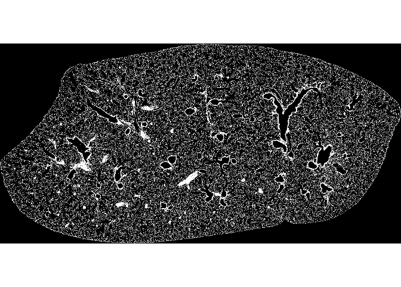
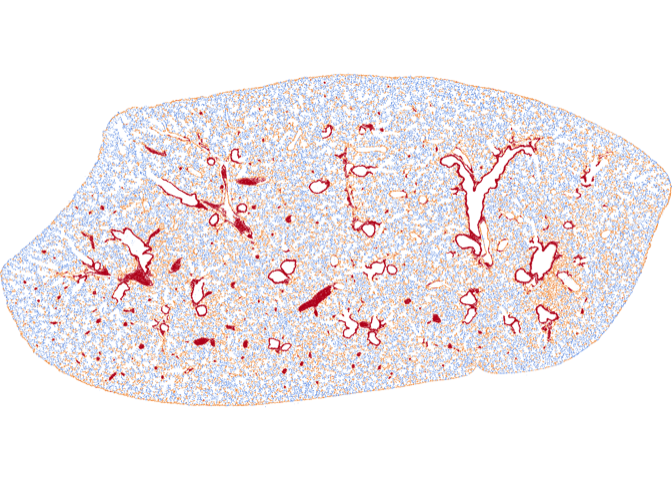
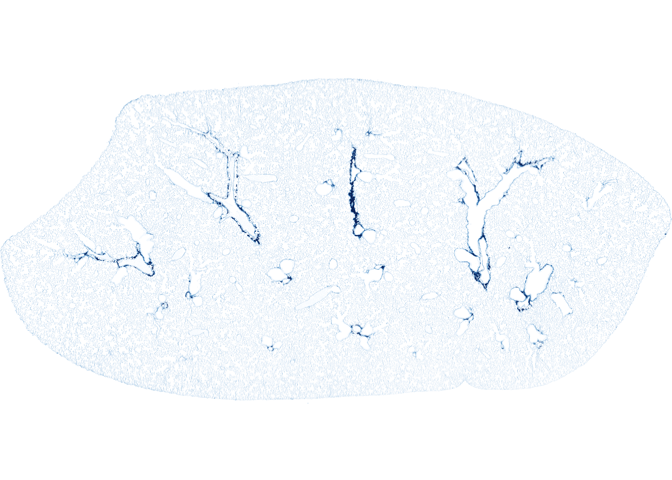
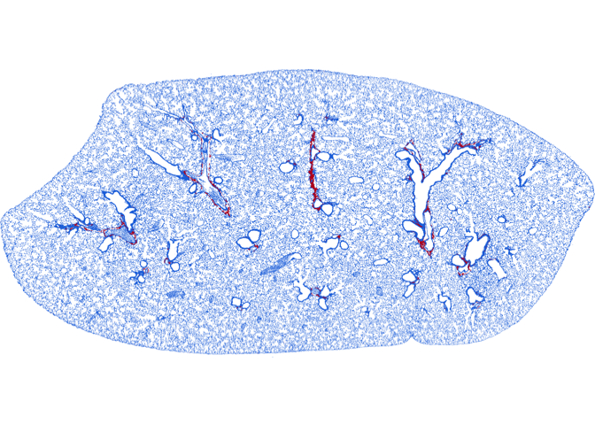
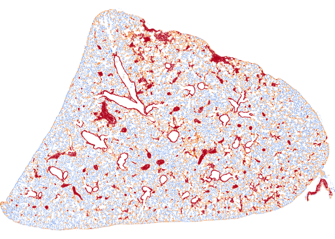

<!-- README.md is generated from README.Rmd. Please edit that file -->

# fibroquant

`fibroquant` quantifies lung fibrosis from histology whole-slide images
without manual annotation. It reads a slide, splits a multi-section
slide into its separate sections, and scores the tissue with an
unsupervised analyzer. The analyzer is pluggable: the first one clusters
tissue colour in CIELAB space, and the interface is built so that new
approaches drop in beside it.

Every run returns two things: a tidy table of per-section scores, and
the fitted analyzer needed to regenerate a per-pixel severity map for
any section.

## Installation

`fibroquant` depends on the Bioconductor packages EBImage and
RBioFormats. Install those first, then the package from GitHub:

``` r
# install.packages("BiocManager")
BiocManager::install(c("EBImage", "RBioFormats"))

# install.packages("pak")
pak::pak("wmoldham/fibroquant")
```

## The pipeline

A run moves through four steps, each with its own object type.
`fq_run()` chains them over a folder of slides; the sections below walk
through them one at a time.

| Step | Function | Returns |
|----|----|----|
| Read | `fq_read()` | an `fq_slide` |
| Split | `fq_split()` | an `fq_sections` of `fq_section`s |
| Fit | `fq_fit()` | a fitted analyzer, e.g. `fq_kmeans_analyzer` |
| Score, map | `fq_score()`, `fq_render()` | a one-row score table, an `fq_field` |

``` r
library(fibroquant)
vsi <- "path/to/slide.vsi"
```

## Reading and splitting a slide

A slide file holds several image series, each at a handful of resolution
levels. `fq_info()` lists them with pixel dimensions and effective
µm/px. This is the table `fq_read()` consults to pick the scan series
and a working resolution.

``` r
fq_info(vsi)
#> # A tibble: 24 × 5
#>    series   res size_x size_y um_px
#>     <int> <int>  <int>  <int> <dbl>
#>  1      1     1   8021   9366 0.274
#>  2      1     2   4011   4683 0.548
#>  3      1     3   2006   2342 1.09 
#>  4      1     4   1003   1171 2.19 
#>  5      1     5    502    586 4.37 
#>  6      1     6    251    293 8.75 
#>  7      2     1  18032   9148 0.274
#>  8      2     2   9016   4574 0.548
#>  9      2     3   4508   2287 1.10 
#> 10      2     4   2254   1144 2.19 
#> # ℹ 14 more rows
```

`fq_read()` returns an `fq_slide`: an RGB array in `[0, 1]` with its
physical scale and provenance. Printing one reports its dimensions,
resolution, and source.

``` r
slide <- fq_read(vsi, target_um_px = 4)
slide
#> <fq_slide> 8777 × 1349 px · 4.38 µm/px · Image_3470.vsi
```

A slide often carries more than one tissue section. `fq_split()` finds
them by connected components and returns an `fq_sections` collection, a
list of `fq_section`s ordered left to right. Each section adds an
analysis mask, a filled silhouette, and its crop box to the slide it
came from.

``` r
sections <- fq_split(slide, n = 2)
sections
#> <fq_sections> 2 section(s)
#>   <fq_section A> 2300 × 1145 px · 4.38 µm/px · 18% tissue · Image_3470.vsi
#>   <fq_section B> 2300 × 1143 px · 4.38 µm/px · 18% tissue · Image_3470.vsi
```

## Visualizing

`plot()` dispatches on each object. A slide plots as the whole scan.

``` r
plot(slide)
```


Plotting the collection lays the sections out as a contact sheet.

``` r
plot(sections)
```


Handing the sections back to the slide draws each crop box on the
parent. This is the quickest check that the split caught every section
and skipped streaks and debris.

``` r
plot(slide, sections = sections)
```


A single section plots on its own, cropped tight to its tissue.

``` r
plot(sections[[1]])
```


## Analyzers

An analyzer is a **spec** plus three methods:

- `fq_fit(spec, sections)` learns a shared basis from a batch of
  sections and returns a fitted analyzer.
- `fq_score(fit, section)` returns a one-row table of metrics for a
  section, always including a `severity_index` so scores are comparable
  across analyzers.
- `fq_render(fit, section)` returns a per-pixel severity field for a
  section, which `plot()` pseudocolours.

The basis is fit once and then frozen, so a grade means the same thing
on every section and every slide. Adding an analyzer means implementing
these three methods for a new spec; reading, splitting, batch scoring,
and plotting all work unchanged (see [Adding an
analyzer](#adding-an-analyzer)).

### k-means colour analyzer

The first analyzer reproduces the LungDamage colour approach:
unsupervised CIELAB clustering of tissue colour, with clusters ranked by
lightness into severity grades. It differs in two ways. It clusters only
masked tissue pixels, so the mask does the job the brightest background
cluster did in MATLAB and three grades suffice where four were needed.
And it fits one shared cluster basis across all sections at once, rather
than re-clustering each image.

**Preprocessing.** Each section is reduced to the pixels and colours the
clustering sees:

1.  **Tissue mask.** An Otsu threshold on luminance separates tissue
    from bright glass and airspace, and the airway and other whitespace
    lumen are excluded. The mask is both the density denominator and the
    pool of pixels to cluster.
2.  **Smoothing.** A Gaussian blur damps stain speckle. It is a
    normalised convolution over the mask, so airspace carries no weight
    into tissue and cannot bleed across the rim.
3.  **Colour space.** Pixels are converted to CIELAB and clustered on
    the `a*` and `b*` chroma channels, leaving lightness (`L*`) free to
    order the grades.

The analysis mask is the heart of the preprocessing. It is carried on
every section, so it can be inspected directly.

``` r
sec <- sections[[1]]
EBImage::display(EBImage::Image(sec@mask * 1), method = "raster")
```



**The spec.** `fq_kmeans()` is the recipe alone: how many grades, which
colour channels, the blur, and the number of k-means restarts. It holds
no fitted state.

``` r
spec <- fq_kmeans(k = 3, channels = c("a", "b"), smooth_sigma = 2, nstart = 3)
spec
#> <fibroquant::fq_kmeans>
#>  @ k           : num 3
#>  @ channels    : chr [1:2] "a" "b"
#>  @ smooth_sigma: num 2
#>  @ nstart      : num 3
#>  @ max_px      : num 1e+05
```

**Fitting the basis.** `fq_fit()` pools the masked pixels across every
section, runs k-means once, and ranks the clusters by mean lightness so
the darkest grade is the most fibrotic. The fit carries the cluster
centres and that ordering.

``` r
fit <- fq_fit(spec, sections)
fit@centers   # one row per grade, in a*b* space
#>          a         b
#> 3 23.67344 -16.50611
#> 2 31.98793 -21.89482
#> 1 48.21619 -26.15269
fit@luminance # mean L* per grade, mildest to most severe
#> [1] 69.98975 66.84377 64.27524
```

**Scoring.** `fq_score()` applies the basis to one section and measures
the area in each grade. It returns one row: a `severity_index` weighted
by area on a 0–10 scale, plus the area fraction in each grade.

``` r
fq_score(fit, sec)
#> # A tibble: 1 × 4
#>   severity_index frac_sev_1 frac_sev_2 frac_sev_3
#>            <dbl>      <dbl>      <dbl>      <dbl>
#> 1           3.80      0.419      0.401      0.180
```

**Mapping.** `fq_render()` labels each tissue pixel with its grade and
returns an `fq_field`. Plotting it pseudocolours the grades from mild
(blue) to severe (red), with off-tissue pixels left white.

``` r
field <- fq_render(fit, sec)
plot(field)
```



### Collagen analyzer

The second analyzer measures Collagen Proportionate Area, the fraction
of tissue stained for collagen. It works on Masson’s trichrome, where
collagen is blue and the counterstain is red. It does not work on H&E,
which does not separate collagen by colour, so this analyzer is gated to
trichrome.

The trichrome dyes overlap in colour, so thresholding blue off the RGB
image is unreliable. The analyzer separates the stains by colour
deconvolution. It converts each pixel to optical density and applies the
inverse of a stain matrix, giving one density channel per dye. The stain
matrix is not fixed. It is estimated from the batch by the Macenko
method, so it adapts to each staining run.

The collagen channel is then thresholded and its area taken as a
fraction of tissue. The threshold is a strict quantile of the collagen
density, learned on the batch. Collagen in lung is a continuum of
densities, not two separable populations. A loose threshold counts the
faint collagen in every alveolar wall, which is present in healthy
tissue. A strict threshold isolates the dense, pathological deposition.
On a bleomycin series the default quantile of 0.98 separated injury from
control where looser rules did not.

**The spec.** `fq_collagen()` is the recipe: the stain-estimation
settings and the collagen quantile. It holds no fitted state.

``` r
spec <- fq_collagen(collagen_quantile = 0.98)
spec
#> <fibroquant::fq_collagen>
#>  @ collagen_quantile: num 0.98
#>  @ beta             : num 0.15
#>  @ alpha            : num 1
#>  @ max_px           : num 1e+05
```

**Fitting the basis.** `fq_fit()` reads a batch of trichrome sections,
pools their masked pixels, estimates the stain matrix, and sets the
collagen threshold from the pooled density. The fit carries the stain
matrix and that threshold.

``` r
mt_sections <- fq_split(fq_read(vsi_mt, target_um_px = 4), n = 2)
cfit <- fq_fit(spec, mt_sections)
cfit@stain_matrix
#>                [,1]       [,2]      [,3]
#> collagen  0.6902723  0.6947046 0.2022615
#> counter   0.2139277  0.9538813 0.2105836
#> residual -0.0893437 -0.1955647 0.9766126
cfit@threshold
#> [1] 0.3715654
```

**Scoring.** `fq_score()` deconvolves one section, measures the tissue
above the collagen threshold, and returns CPA as the `severity_index`.
Collagen scores stack into the same table as any other analyzer.

``` r
fq_score(cfit, mt_sections[[1]])
#> # A tibble: 1 × 1
#>   severity_index
#>            <dbl>
#> 1           2.41
```

**Mapping.** `fq_render()` returns an `fq_field` to plot. Pass
`density = TRUE` to see the collagen channel itself, the deconvolved
blue signal. White is clear tissue and deeper blue is denser collagen,
so it reads like the blue stain with the pink removed.

``` r
plot(fq_render(cfit, mt_sections[[1]], density = TRUE))
```



The default view is the collagen mask, the pixels CPA counts. Collagen
is red against blue tissue. Both confirm the deconvolution finds
collagen where it belongs, around the airways and vessels.

``` r
plot(fq_render(cfit, mt_sections[[1]]))
```



## Batch processing

Scoring generalises from one slide to a folder of them. `fq_manifest()`
discovers the slides and gives each a stable `slide_id` for joining
scores back to files. Add experimental covariates as further columns and
they ride through to the results.

``` r
# fq_manifest() scans a folder of slides, e.g. "/path/to/slide/folder".
manifest <-
  fq_manifest(dirname(vsi)) |>
  dplyr::filter(!grepl("_01", slide_id)) |>
  dplyr::filter(stringr::str_detect(slide_id, "3470|3472|3478|3479"))
manifest$treatment <- c("saline", "saline", "bleo", "bleo")
manifest
#> # A tibble: 4 × 3
#>   slide_id   path                                            treatment
#>   <chr>      <chr>                                           <chr>    
#> 1 Image_3470 /Volumes/Will/Mouse lung 6.10.26/Image_3470.vsi saline   
#> 2 Image_3472 /Volumes/Will/Mouse lung 6.10.26/Image_3472.vsi saline   
#> 3 Image_3478 /Volumes/Will/Mouse lung 6.10.26/Image_3478.vsi bleo     
#> 4 Image_3479 /Volumes/Will/Mouse lung 6.10.26/Image_3479.vsi bleo
```

`fq_run()` fits the analyzer once on a representative subsample of the
slides, then splits and scores every slide on that shared basis. It
returns the per-section `scores` table with covariates joined on, and
the `fit` itself. By default it fits on up to 25 slides; pass `stratify`
to spread that budget across a covariate, for example
`stratify = "treatment"`, so the basis spans the range of injury.

``` r
result <- fq_run(manifest, fq_kmeans(k = 3), progress = FALSE)
result@scores
#> # A tibble: 8 × 7
#>   slide_id   section severity_index frac_sev_1 frac_sev_2 frac_sev_3 treatment
#>   <chr>      <chr>            <dbl>      <dbl>      <dbl>      <dbl> <chr>    
#> 1 Image_3470 A                 4.22      0.367      0.424      0.210 saline   
#> 2 Image_3470 B                 4.59      0.310      0.463      0.227 saline   
#> 3 Image_3472 A                 2.90      0.549      0.322      0.129 saline   
#> 4 Image_3472 B                 3.29      0.470      0.401      0.129 saline   
#> 5 Image_3478 A                 4.97      0.315      0.375      0.309 bleo     
#> 6 Image_3478 B                 4.88      0.320      0.383      0.297 bleo     
#> 7 Image_3479 A                 5.84      0.195      0.442      0.363 bleo     
#> 8 Image_3479 B                 5.88      0.190      0.444      0.366 bleo
```

The result also carries everything needed to redraw any section’s
severity map after the fact, without refitting. `fq_map()` replays the
read-and-split from the recipe the run recorded and renders the section
through the run’s fit, returning a plottable field in one call:

``` r
plot(fq_map(result, "Image_3478", "A"))

# `[[` is the terse shorthand for the same thing:
#   result[["Image_3470", "A"]]
# Drop the section to get every section of a slide, as a named list of maps.
maps <- fq_map(result, "Image_3470")
```



Parallelism is optional and controlled by the caller. Set
`mirai::daemons(n)` in your session and the work for each slide runs
across those daemons; with none set it runs sequentially. A parallel run
needs the package installed, because each daemon loads `fibroquant` to
do the scoring.

## Adding an analyzer

A new analyzer is a spec class, a fitted-analyzer class, and the three
methods. The sketch below is a complete, if trivial, analyzer; swap in
real logic for the `...`.

``` r
# 1. A spec: hyperparameters only, no fitted state.
fq_threshold <- S7::new_class(
  "fq_threshold",
  parent = fq_spec,
  properties = list(
    cutoff = S7::new_property(S7::class_numeric, default = 0.5)
  )
)

# 2. A fitted analyzer: the basis fq_fit() learns.
fq_threshold_analyzer <- S7::new_class(
  "fq_threshold_analyzer",
  parent = fq_analyzer,
  properties = list(cutoff = S7::class_numeric)
)

# 3. The three methods.
S7::method(fq_fit, fq_threshold) <- function(spec, sections, ...) {
  fq_threshold_analyzer(cutoff = spec@cutoff) # nothing to learn here
}

S7::method(fq_score, fq_threshold_analyzer) <- function(fit, section, ...) {
  tibble::tibble(severity_index = ...) # one row, always a severity_index
}

S7::method(fq_render, fq_threshold_analyzer) <- function(fit, section, ...) {
  fq_field(values = ..., k = ...) # per-pixel grades for plotting
}
```

With those in place, `fq_threshold()` works everywhere `fq_kmeans()`
does, including inside `fq_run()`.
