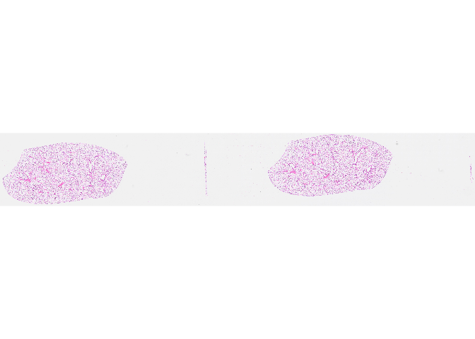
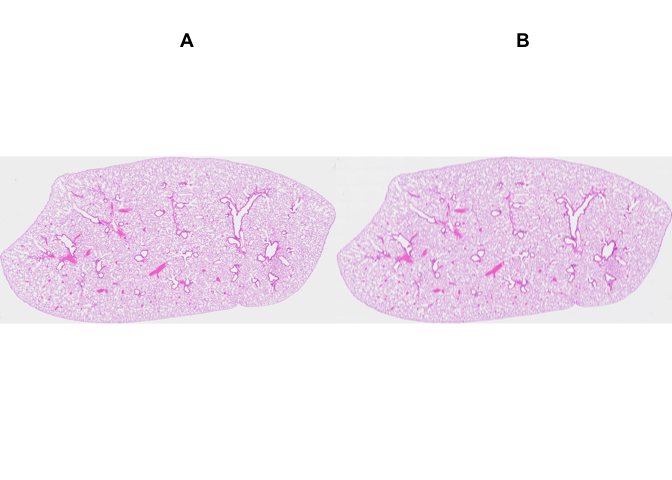
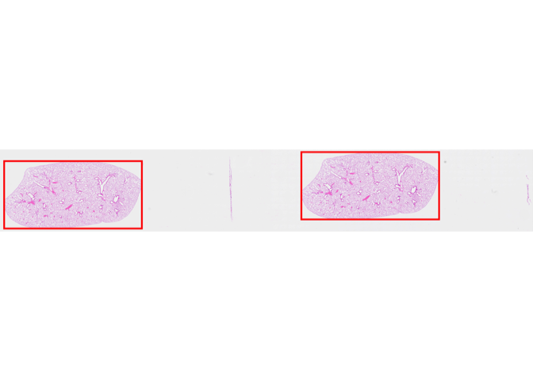
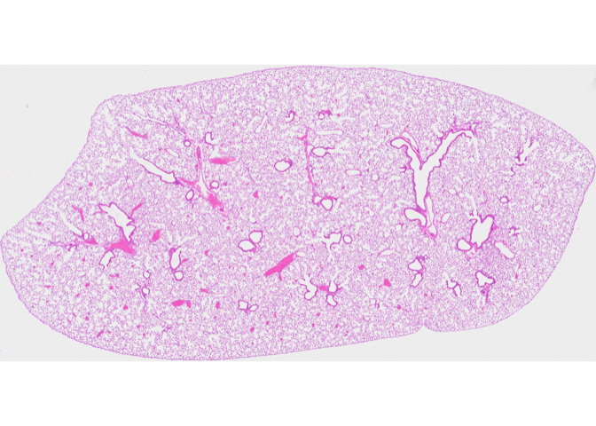

<!-- README.md is generated from README.Rmd. Please edit that file -->

# fibroquant

`fibroquant` quantifies lung fibrosis from histology whole-slide images
without manual annotation. It reads a slide, optionally splits a
multi-section slide into its separate sections, and scores tissue with a
choice of unsupervised analyzers: color clustering, collagen
proportionate area, tissue density, and texture.

## Reading and splitting a slide

``` r
# library(fibroquant)
devtools::load_all()
#> ℹ Loading fibroquant

# vsi <- "/path/to/vsi/image"
vsi <- "/Volumes/Will/Mouse lung 6.10.26/Image_3470.vsi"
has_vsi <- file.exists(vsi)
```

A slide file exposes several image series, each at a handful of
resolution levels. `fq_info()` lists them with pixel dimensions and
effective µm/px — the table `fq_read()` consults to pick the scan series
and a working resolution:

``` r
fq_info(vsi)
#> # A tibble: 24 × 5
#>    series   res size_x size_y um_px
#>     <int> <int>  <int>  <int> <dbl>
#>  1      1     1   8021   9366 0.274
#>  2      1     2   4011   4683 0.548
#>  3      1     3   2006   2342 1.09 
#>  4      1     4   1003   1171 2.19 
#>  5      1     5    502    586 4.37 
#>  6      1     6    251    293 8.75 
#>  7      2     1  18032   9148 0.274
#>  8      2     2   9016   4574 0.548
#>  9      2     3   4508   2287 1.10 
#> 10      2     4   2254   1144 2.19 
#> # ℹ 14 more rows
```

`fq_read()` returns an `fq_slide`: an RGB array in `[0, 1]` with its
physical scale and provenance. Printing one reports its dimensions,
resolution, and source:

``` r
slide <-
  fq_read(
    vsi,
    target_um_px = 4
  )
slide
#> <fq_slide> 8777 × 1349 px · 4.38 µm/px · Image_3470.vsi
```

A slide often carries more than one tissue section. `fq_split()` finds
them and returns an `fq_sections` collection — a list of `fq_section`s
that prints a one-line summary per section:

``` r
sections <-
  fq_split(
    slide,
    n = 2
  )
sections
#> <fq_sections> 2 section(s)
#>   <fq_section A> 2300 × 1145 px · 4.38 µm/px · 76% tissue · Image_3470.vsi
#>   <fq_section B> 2300 × 1143 px · 4.38 µm/px · 77% tissue · Image_3470.vsi
```

## Visualizing

`plot()` dispatches on each object. A slide plots as the whole scan:

``` r
plot(slide)
```



Plotting the collection lays the sections out as a contact sheet:

``` r
plot(sections)
```



Handing the sections back to the slide draws each crop rectangle on the
parent — the quickest check that the split caught every section and
skipped streaks and debris:

``` r
plot(slide, sections = sections)
```



A single section plots on its own, cropped tight to its tissue:

``` r
plot(sections[[1]])
```



## Scoring fibrosis

Each section is scored by one or more unsupervised analyzers — color
clustering, collagen proportionate area, tissue density, and texture.
The workflow fits an analyzer once on the pooled sections, then reads
back a per-section score table and a severity map for each section. That
layer is the next piece under construction; its chunks slot in here as
the analyzers land.

### k-means colour analyzer

The first analyzer reproduces the LungDamage colour approach —
unsupervised CIELAB clustering of tissue colour, clusters ranked
dark-to-light into three severity grades (severe / moderate / healthy) —
with two changes. It clusters only masked tissue pixels: the mask does
the job LungDamage’s brightest, background cluster did, so three
clusters suffice where MATLAB used four. And it fits one shared cluster
basis across all sections at once (fit-once / apply-many) instead of
re-clustering each image.

``` r
slide    <- fq_read(vsi)
sections <- fq_split(slide, n = 2)
sec      <- sections[[1]]
```

#### 1. The spec

`fq_kmeans()` is just the recipe — how many grades, which colour
channels, the blur, the number of k-means restarts. It holds no fitted
state.

``` r
spec <- 
  fq_kmeans(
    k = 3,
    channels = c("a", "b"),
    smooth_sigma = 2,
    nstart = 3
  )
spec
```

#### 2. Smoothing

A Gaussian blur (sigma in pixels) damps single-pixel stain speckle
before clustering. Same H×W×3 array, slightly softened.

``` r
sm <- fibroquant:::.smooth(sec@rgb, sigma = 2)
EBImage::display(EBImage::Image(sm, colormode = "Color"), method = "raster")
```

#### 3. CIELAB — a and b channels

`rgb2lab`, then keep `a*` and `b*`: the colour axes, with lightness
(`L*`) set aside. The two channels are shown below.

``` r
lab <- fibroquant:::.lab(sm)
EBImage::display(EBImage::normalize(lab[, , 2]), method = "raster") # a*
EBImage::display(EBImage::normalize(lab[, , 3]), method = "raster") # b*
```

#### 4. The clustering input

Pull the `a*`/`b*` values at masked tissue pixels only — the clustering
input, and the fibroquant change from LungDamage. An N×2 matrix, one row
per tissue pixel.

``` r
feat <- fibroquant:::.features(lab, sec@mask, channels = c("a", "b"))
dim(feat)
head(feat)
```

#### 5. Fitting the basis

`fq_fit` pools tissue pixels across every section, runs k-means once,
then ranks the clusters by ascending tissue luminance (`L*`) — darkest
grade = most fibrotic. The fit carries the cluster centres and that
severity ordering; nothing is stored back on the sections.

``` r
fit <- fq_fit(sections, spec)
fit@centers  # 3 x 2 in a*b* space
fit@severity # cluster -> rank: mean L*, severity 1..3
```

#### 6. Per-section score

`fq_score` applies the fitted basis to one section and measures area per
grade. One row: `severity_index` (area-weighted, 0–1) plus `frac_sev_1`
… `frac_sev_3`.

``` r
fq_score(sec, fit)
```

#### 7. The severity map

`fq_render` labels each tissue pixel with its grade, returning an
`fq_render` object (an H×W field, NA off tissue). Plotting it
pseudocolours the grades (severe / moderate / healthy → R/G/B); that
plot method lands with the plot functions.

``` r
rendered <- fq_render(sec, fit)
plot(rendered)
```
